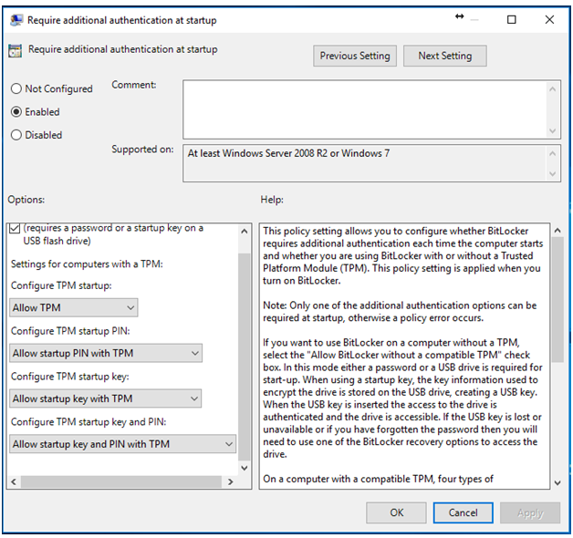

# Security Settings

### **Bit-locker & Truest-locker installation and configuration**

1. Make sure TPM is enabled and active in the BIOS
2. Open Local Group Policy
3. Go to Local Computer Policy -&gt; Computer Configuration -&gt; Administrative Templates -&gt; WindowsComponents -&gt; BitLocker Drive Encryption -&gt; Operating system Drives 
4. Edit “Require additional authentication at startup” and enable it with following default settingsEdit 
5. Edit “Configure minimum PIN length for startup” and change the Minimum characters to 12 
6. Go to Control Panel -&gt; BitLocker Drive Encryption, turn on BitLocker and follow the instructions.

